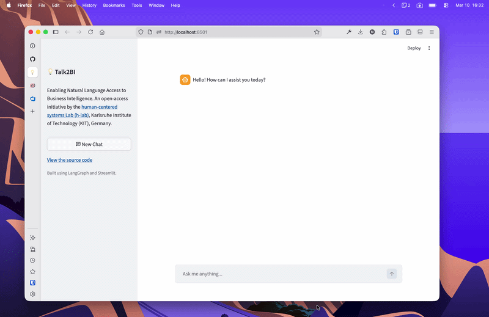

# Talk2BI

[](https://h-lab.win.kit.edu)
[](https://streamlit.io)


[](https://fastapi.tiangolo.com)
[](https://openai.com/)
[](https://www.python.org/)
[](https://github.com/astral-sh/uv)

Open source is a commitment to transparency, accountability, and collective improvement. Talk2BI follows this principle by making business intelligence accessible through natural language; without sacrificing rigor or reproducibility. Our goal is to remove barriers so that understanding, verifying, and extending AI-based systems is possible for everyone. Anyone should be able to use software, inspect its logic, understand how it works, and build upon it. Talk2BI supports persistent chat history and enables secure access to enterprise data, including Databricks-backed data sources. Built with LangGraph, FastAPI and Streamlit, as an open-access initiative by the [Human-Centered Systems Lab (h-Lab)](https://h-lab.win.kit.edu) at Karlsruhe Institute of Technology (KIT), Germany.



## Get started

1. Install uv  
   https://docs.astral.sh/uv/getting-started/installation/

2. Install dependencies
   ```bash
   uv sync
   ```

3. Create your .env file
   ```bash
   cp .env.example .env
   ```

4. Configure environment variables for your AI model and database connection (Databricks)
   ```bash
   # Edit .env and set your keys
   OPENAI_API_KEY=...
   ...
   DATABRICKS_HOST=...
   ...
   ```

5. Run the FastAPI backend with streaming

   The backend exposes the LangGraph agent behind a FastAPI app with a
   streaming endpoint using `astream_events`.

   ```bash
   cd src
   uv run uvicorn api.route:app --host 0.0.0.0 --port 8000 --reload
   ```

   - Health check: `GET /health`
   - Streaming endpoint: `POST /chat/stream`

   Example request body:

   ```json
   {
     "messages": [
       {"role": "user", "content": "Hello!"}
     ]
   }
   ```

   The response is an SSE (Server-Sent Events) stream forwarding the
   raw LangGraph `astream_events` for maximum flexibility on the client
   side.

   By default, the Streamlit frontend talks to the backend at
   `http://localhost:8000`.

6. Run the Streamlit application
   ```bash
   cd src
   uv run streamlit run streamlit_app.py
   ```

7. Inspect the (local db using)
sqlite3 data/chat_logs.db "SELECT id, session_id, role, substr(content,1,80) AS snippet, created_at FROM chat_messages ORDER BY id DESC LIMIT 20;"


## Main code structure

```bash
src/
├── streamlit_app.py    # Streamlit UI
├── agent/
│   ├── agent.py        # Main agent
│   └── utils/
│       ├── prompt.py   # agent prompt
│       └── tools.py    # Agent tools
├── utils/              
│   └── astream.py      # Stream util
└── api/              
    └── route.py      # API route  
```

- To change the **agent behavior** (how queries are interpreted, how tools are used, etc.), edit `src/agent/agent.py` and the helper files in `src/agent/utils/`.
- To change the **application UI and overall flow**, edit `src/streamlit_app.py`.
- To adjust **streaming behaviour**, see `src/utils/astream.py`.

## Contributing

We welcome contributions from everyone! Whether it’s bug fixes, new features, documentation improvements, or ideas, your help makes Talk2BI better.

To contribute:
1.	Fork the repo and create a branch.
2.	Make changes and follow PEP8/code style.
3.	Commit with a clear message and push your branch.
4.	Open a Pull Request describing your changes.

Feel free to also report bugs via GitHub issues.

## Acknowledgements

Talk2BI is made possible thanks to the incredible work of the open-source community. Thank you to all the developers, maintainers, and contributors whose tools, libraries, and ideas we rely on every day. For questions or feedback, you can reach out to Niklas Wagner at [niklas.wagner@kit.edu](mailto:niklas.wagner@kit.edu).

## License

This project is licensed under the MIT License. See the [LICENSE](LICENSE)
file for full license text.


