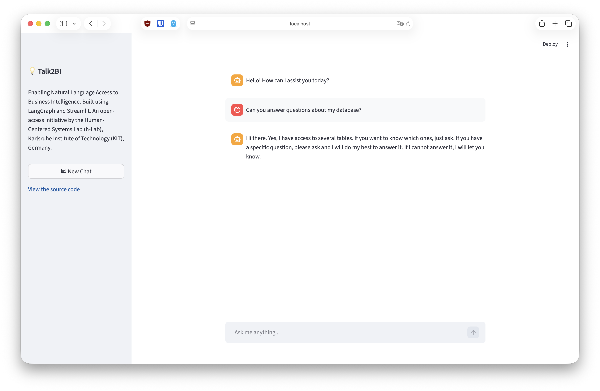

# Talk2BI

Open source is a commitment to transparency, accountability, and collective improvement. Talk2BI follows this principle by making business intelligence accessible through natural language; without sacrificing rigor or reproducibility. Our goal is to remove barriers so that understanding, verifying, and extending AI-based systems is possible for everyone. Anyone should be able to use software, inspect its logic, understand how it works, and build upon it. Built with LangGraph and Streamlit, Talk2BI is an open-access initiative by the [Human-Centered Systems Lab (h-Lab)](https://h-lab.win.kit.edu) at Karlsruhe Institute of Technology (KIT), Germany.



## Get started

1. Install uv  
   https://docs.astral.sh/uv/getting-started/installation/

2. Install dependencies
   ```bash
   uv sync
   ```

3. Create your .env file
   ```bash
   cp .env.example .env
   ```

4. Configure environment variables
   ```bash
   # Edit .env and set your keys
   OPENAI_API_KEY=...
   # ...
   ```

5. Run the application
   ```bash
   cd src
   uv run streamlit run streamlit_app.py
   ```

## Main code structure

```bash
src/
├── streamlit_app.py   # Streamlit UI
└── agent/
    └── agent.py       # Agent logic
```

If you want to change the agent behavior, go to `src/agent/agent.py`.  
If you want to change the application (UI and overall flow), go to `src/streamlit_app.py`.

## Contributing

Contributions are very welcome.

- For code changes, fork the repository and open a pull request with a clear description of the motivation and the changes.
- When possible, keep changes small and focused, and align with the existing project structure (`src/agent` for agent behavior, `src/streamlit_app.py` for UI).

We especially welcome contributions that:

- Add or improve various agent tools (data sources, BI operations, semantic search, etc.).
- Enhance the UI and user experience (chat interactions, visualizations, filters, history, etc.).
- Improve BI-related capabilities more broadly (analysis flows, explanations, guidance).
- Enhance the prompt, agent logic, or evaluation.
- Polish the developer experience (docs, examples, or tests).

## License

This project is licensed under the MIT License. See the [LICENSE](LICENSE)
file for full license text.

