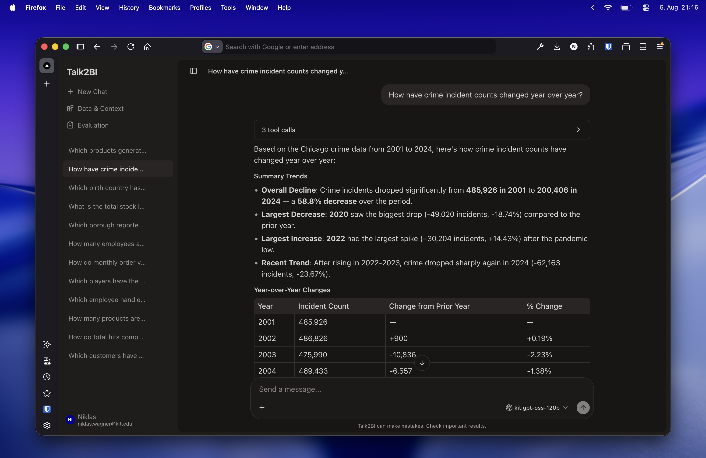
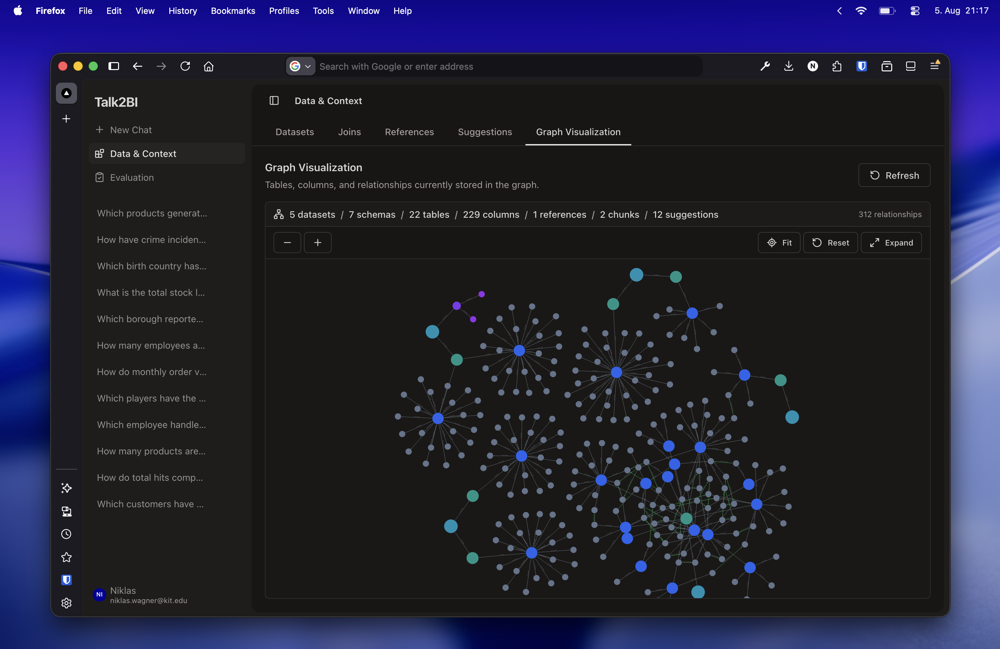

# Talk2BI


[](#)
[](#)
[](#)
[](#)
[](#)
[](#)
[](#)
[](#)
[](#)

Talk2BI is an open-source data assistant: ask a question in plain language and it writes the SQL, runs it against your warehouse, and answers you in the language you asked in. A property graph of your tables, columns, joins, and reference documents keeps those answers grounded in what your data actually means. 



Text-to-SQL systems can achieve very strong results, but many practical deployments show that they often need to be complemented with domain references and linked to business context to produce reliable, usable answers.
Talk2BI addresses this by providing a research-first open-source application:

- A **persistent, multi-thread chat interface** built on Assistant UI.
- A **single, well-defined persistence layer** for chat history that can be replaced with your own database.
- A **pluggable model abstraction layer** that lets you seamlessly switch between providers (e.g., OpenAI, Azure, or local models like Ollama or LM-Studio).
- A **Property graph** that makes structured and unstructured data and its relationships first-class and navigable.
- **Open Knowledge Format (OKF) v0.2** for portable, structured data context and reference knowledge.



## Technology Stack

- **Frontend**: Next.js 16+ with React 19 and Assistant UI for pre-built conversational interface
- **AI Engine**: Vercel AI SDK using OpenAI Compatible Models
- **Data Platforms**: Snowflake, Databricks, Neo4j
- **UI**: Radix UI components with Tailwind CSS

## Prerequisites

- Bun 1.2+ (or Node.js 20+ with npm)
- Docker, if you want to run Neo4j locally
- A Supabase project
- A Neo4j instance (Docker, local Neo4j Desktop, or managed AuraDB)
- A Snowflake or Databricks Instance

## Run Talk2BI

1. Create a supabase project.

    Login to https://supabase.com/


2. Get your a Neo4j Instance. Either visit https://console.neo4j.io/ or run one in Docker on your machine (Docker must run)

    ```bash
    docker run -d --name talk2bi-neo4j -p 7474:7474 -p 7687:7687 -e NEO4J_AUTH=neo4j/password -v talk2bi-neo4j-data:/data neo4j:2026.05
    ```

    The container publishes two ports: Bolt on `7687`, which is what the app connects to, and the Neo4j Browser on http://localhost:7474, where you can sign in with `neo4j` / `password` to inspect the graph. The credentials above match the `NEO4J_*` defaults in `.env.example`, so they work without further changes.

    Two things worth knowing. `NEO4J_AUTH` only takes effect on the very first start, because the password is then stored in the `talk2bi-neo4j-data` volume — to change it later, remove the container and the volume rather than editing the flag:

    ```bash
    docker rm -f talk2bi-neo4j && docker volume rm talk2bi-neo4j-data
    ```

    And Neo4j rejects passwords shorter than eight characters, so pick a longer one if you replace the default. The named volume keeps your graph across restarts; use `docker stop talk2bi-neo4j` and `docker start talk2bi-neo4j` to pause and resume without losing data.

    Talk2BI stores its embeddings in Neo4j's native vector indexes, so the release matters: `2026.05` above is the line Talk2BI is developed against, and the `5.26` LTS works too. No APOC or GDS plugins are required.

    If the ports are already taken, another Neo4j is likely running — check with `docker ps` and reuse it instead of starting a second one.

3. Ensure you got a Databricks (Free Edition) or Snowflake Project

4. Copy .env.example to .env.local and add your credentials

    ```bash
    cd src/my-app
    cp .env.example .env.local
    ```

5. Install Bun. Visit https://bun.sh/docs/installation, or on macOS and Linux run

    ```bash
    curl -fsSL https://bun.sh/install | bash
    ```

    On Windows, use `powershell -c "irm bun.sh/install.ps1 | iex"`.

6. Install the packages from the app directory

    ```bash
    cd src/my-app
    bun install
    ```

7. Finally, run the app local on your machine

    ```bash
    bun run dev
    ```

    The app is then served at http://localhost:3000.

## Acknowledges

A collaboration of contributors from

<table>
  <tr>
    <td align="center" width="20%">
      <a href="https://www.kit.edu">
        
      </a>
      <br>
      <sub>Karlsruhe Institute of Technology</sub>
    </td>
    <td align="center" width="20%">
      <a href="https://www.enbw.com">
        
      </a>
      <br>
      <sub>EnBW Energie Baden-Württemberg AG</sub>
    </td>
    <td align="center" width="20%">
      <a href="https://www.kcl.ac.uk">
        
      </a>
      <br>
      <sub>King's College London</sub>
    </td>
    <td align="center" width="20%">
      <a href="https://menschki.org">
        
      </a>
      <br>
      <sub>MenschKI!</sub>
    </td>
    <td align="center" width="20%">
      <a href="https://theodi.org/">
        
      </a>
      <br>
      <sub>Open Data Institute</sub>
    </td>
  </tr>
</table>

KIT, EnBW, King's College London, MenschKI!, and the [Open Data Institute (ODI)](https://theodi.org/) contributed under a shared mission for research-first, transparent end to end data assistants. The Talk2BI idea has been applied to an enterprise use case, achieving 97.14% execution accuracy.

Founder: Niklas Wagner — [niklas.wagner@kit.edu](mailto:niklas.wagner@kit.edu)
